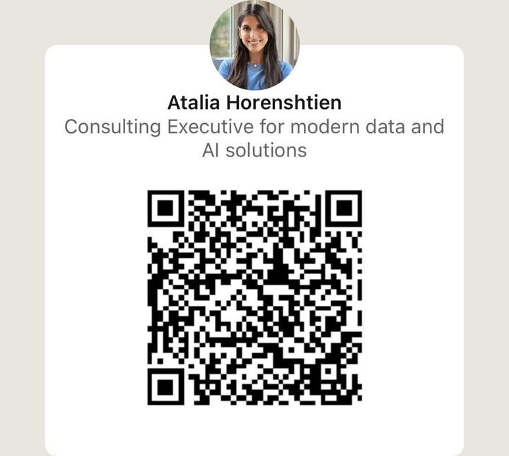
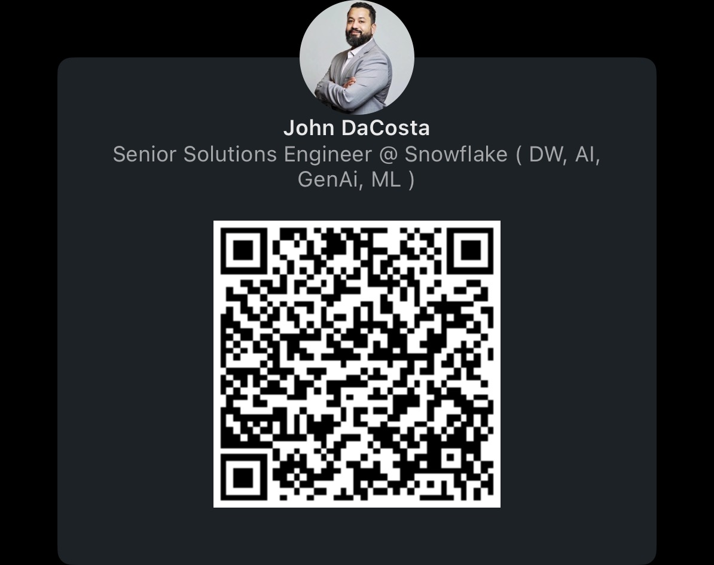

# Miami Hands-On Lab: Snowflake Intelligence for Builders

## Welcome! 👋

Thank you for joining **Snowflake and Hakkoda, an IBM Company** for this interactive hands-on lab on **Snowflake Cortex Intelligence**.

**Event Details:**

- **Date:** Thursday, October 16, 2025
- **Time:** 4:00 PM - 6:00 PM ET
- **Location:** The LAB Miami, 2750 NW 3rd Ave, Suite 24, Miami, FL 33127

**Your Instructors:**

- [**Atalia Horenshtien**](https://www.linkedin.com/in/ataliahorenshtien/) - Consulting Client Executive, Hakkoda (an IBM Company)
- [**Jacob Scott**](https://www.linkedin.com/in/jacobscottengineer/) - Senior Consultant, AI Engineering, Hakkoda (an IBM Company)
- [**John DaCosta**](https://www.linkedin.com/in/mrjdacosta/) - Senior Solution Engineer, Snowflake

---

## What You'll Learn

In this guided session, we'll walk you step-by-step through how to use Snowflake Intelligence for tangible business outcomes—from setting up your environment and connecting to live data, to applying AI-powered features that surface insights faster.

You'll gain practical "how-to" skills, a repeatable framework, and the confidence to unlock intelligence from your own data with Snowflake and Hakkoda.

---

## Lab Access Links

**Snowflake Account (Laptop):**  
[Snowflake Account for Hands On Lab](https://app.snowflake.com/ipesivy/iw58732/)

**Snowflake Intelligence (Mobile-Friendly):** 📱  
[Snowflake Intelligence for Hands On Lab](https://ai.snowflake.com/ipesivy/iw58732)

> 💡 **Tip:** The Snowflake Intelligence link works great on your mobile phone! You can explore and interact with AI features right from your device.

---

## Password = "{username}@HOL!"

## Prerequisites

- Laptop charged and ready
- Basic knowledge of Python and SQL
- Snowflake account (provided above)

---

Let's get started! 🚀

---

## Contact Us

Have questions or need assistance? Connect with your instructors!### Jacob Scott

**Senior Consultant, AI Engineering**  
Hakkoda, an IBM Company

[Connect on LinkedIn](https://www.linkedin.com/in/jacobscottengineer/)

---

### Atalia Horenshtien

**Instructor**

[Connect on LinkedIn](https://www.linkedin.com/in/ataliahorenshtien/)

### John DaCosta

**Senior Solutions Engineer**  
Snowflake

[Connect on LinkedIn](https://www.linkedin.com/in/mrjdacosta/)

We're here to help you succeed in your Snowflake Intelligence journey!
